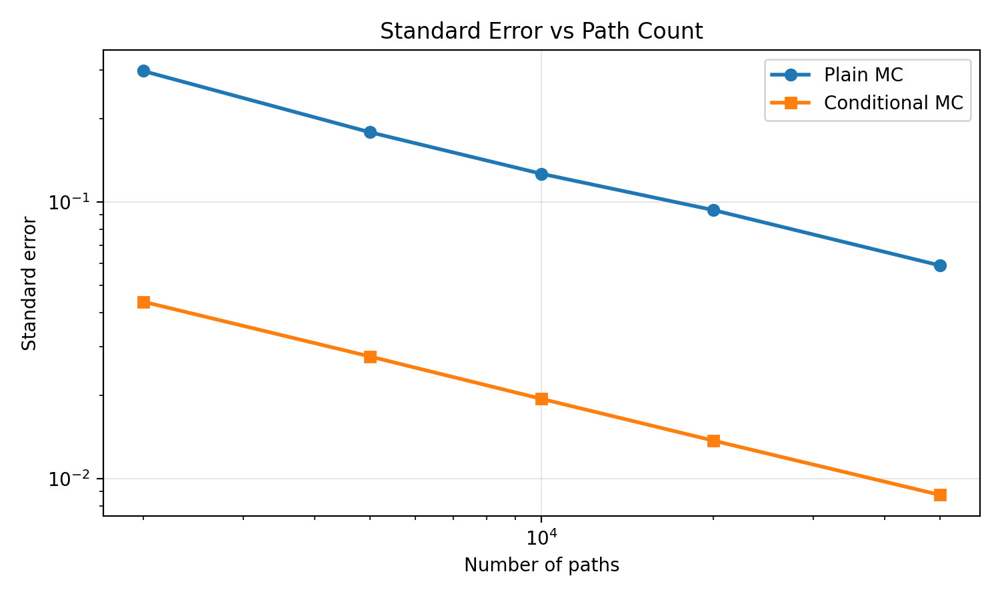
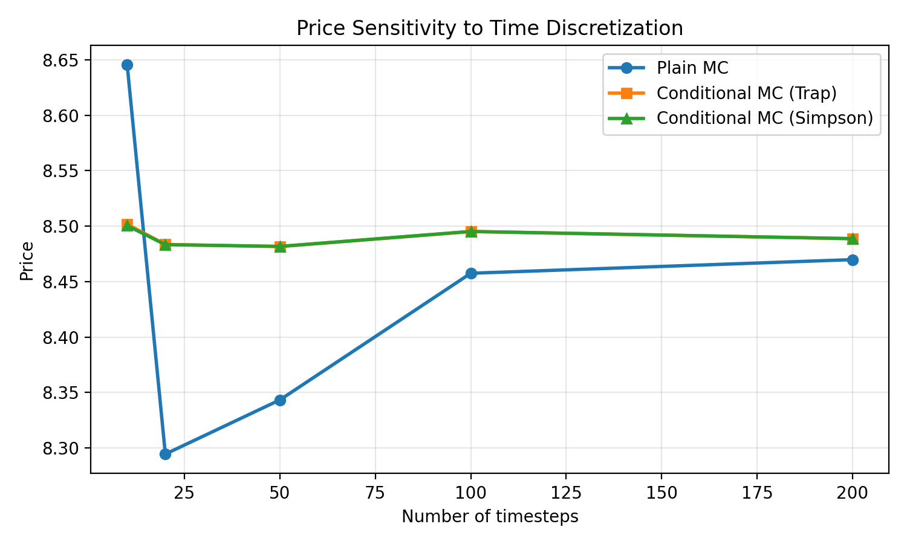
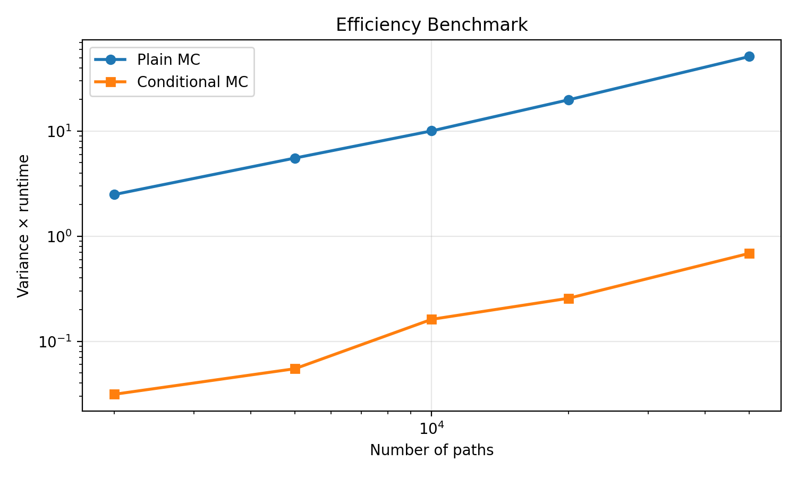

# SABR Option Pricing with Conditional Monte Carlo

*A Python implementation of SABR option pricing with plain Monte Carlo, conditional Monte Carlo, integrated variance approximation, and benchmarking for a MATH 5030 final project.*

## Project Overview

This repository studies numerical pricing of European call options under the SABR stochastic volatility model. The project focuses on the beta = 1 case and compares two estimators:

- plain Monte Carlo, which simulates the full asset path directly
- conditional Monte Carlo, which simulates only the volatility path and then prices conditionally with a Black-Scholes formula

The main goal is to measure how much variance reduction and computational efficiency can be gained from conditioning on the volatility path. The repository includes reusable pricing modules, experiment scripts, saved benchmark tables, and figures suitable for a course project report.

## SABR Model Setup

We work with the SABR model:

```text
dS_t = sigma_t S_t^beta dW_t
d sigma_t = nu sigma_t dZ_t
dW_t dZ_t = rho dt
```

In the current implementation we restrict attention to **beta = 1**, so the asset dynamics reduce to a stochastic-volatility lognormal model. The parameters are:

- `S0`: initial asset price
- `sigma0`: initial volatility
- `beta`: SABR backbone parameter
- `nu`: volatility of volatility
- `rho`: correlation between the asset and volatility shocks
- `r`: risk-free rate

For the asset-path simulation, we use the beta = 1 log-Euler update:

```text
log S_{t+dt} = log S_t + (r - 0.5 sigma_t^2) dt + sigma_t sqrt(dt) Z
```

with the left-endpoint volatility on each step. This preserves positivity of the simulated asset price.

## Numerical Methods Implemented

### Plain Monte Carlo

The plain Monte Carlo pricer simulates both volatility paths and asset-price paths, computes discounted call payoffs, and estimates the option value by a sample average.

### Conditional Monte Carlo

For beta = 1, we use the standard decomposition:

```text
dW_t = rho dZ_t + sqrt(1-rho^2) dW_t^perp
```

Conditioning on the volatility path gives:

```text
log S_T = log S_0 + rT - 0.5 V_T + (rho/nu)(sigma_T - sigma_0)
          + sqrt((1-rho^2) V_T) N
V_T = integral_0^T sigma_t^2 dt
```

This reduces each path to a conditional Black-Scholes call with:

- conditional spot: `S_cond = S_0 * exp((rho/nu)(sigma_T - sigma_0) - 0.5 rho^2 V_T)`
- conditional volatility: `sigma_cond = sqrt((1-rho^2) V_T / T)`

The conditional Monte Carlo estimator therefore replaces noisy payoff simulation with pathwise conditional prices, which substantially reduces variance.

### Integrated Variance Approximation

The project implements two numerical approximations for

`V_T = integral_0^T sigma_t^2 dt`

- trapezoidal rule
- Simpson's rule

Both operate on the same path convention used throughout the codebase:

- path arrays have shape `(n_paths, n_steps + 1)`
- shock arrays have shape `(n_paths, n_steps)`

## Repository Structure

```text
.
├── README.md
├── requirements.txt
├── src/
│   ├── __init__.py
│   ├── black_scholes.py
│   ├── conditional_mc.py
│   ├── integration.py
│   ├── mc_pricer.py
│   ├── sabr_simulation.py
│   └── utils.py
├── experiments/
│   ├── experiment_hagan_comparison.py
│   ├── experiment_parameter_sweep_nu.py
│   ├── experiment_runtime.py
│   ├── experiment_timestep.py
│   ├── experiment_validation_bs_limit.py
│   └── experiment_variance.py
├── results/
│   ├── figures/
│   └── tables/
└── report/
    └── references.md
```

Key saved outputs:

- variance benchmark table: [results/tables/variance_comparison_beta1_call.csv](results/tables/variance_comparison_beta1_call.csv)
- timestep benchmark table: [results/tables/timestep_sensitivity_beta1_call.csv](results/tables/timestep_sensitivity_beta1_call.csv)
- runtime benchmark table: [results/tables/runtime_benchmark_beta1_call.csv](results/tables/runtime_benchmark_beta1_call.csv)

## Installation

Clone the repository and install the required packages:

```bash
git clone https://github.com/PXYE-1029/SABR-Option-Pricing-Conditional-MC.git
cd SABR-Option-Pricing-Conditional-MC
python3 -m pip install -r requirements.txt
```

The project currently depends on:

- `numpy`
- `scipy`
- `matplotlib`

## How to Run

Run the runtime benchmark:

```bash
python3 experiments/experiment_runtime.py
```

Run the variance comparison:

```bash
python3 experiments/experiment_variance.py
```

Run the timestep sensitivity experiment:

```bash
python3 experiments/experiment_timestep.py
```

Run the dedicated Black-Scholes-limit validation experiment:

```bash
python3 experiments/experiment_validation_bs_limit.py
```

Run the vol-of-vol parameter sweep:

```bash
python3 experiments/experiment_parameter_sweep_nu.py
```

Each script:

- prints a short summary to the terminal
- saves a CSV table under `results/tables/`
- saves one or more figures under `results/figures/`

### Additional Experiment Coverage

- `experiment_validation_bs_limit.py` isolates the `nu = 0` deterministic-volatility case and compares plain MC, conditional MC, and the exact Black-Scholes benchmark across several path counts.
- `experiment_parameter_sweep_nu.py` varies the SABR vol-of-vol parameter `nu` over a fixed grid to test whether the conditional Monte Carlo variance-reduction advantage persists away from the baseline parameter set.

## Results Summary

All current benchmarks use the beta = 1 SABR setup

- `S0 = 100`
- `sigma0 = 0.2`
- `K = 100`
- `T = 1`
- `r = 0.01`
- `nu = 0.4`
- `rho = -0.3`

unless a validation case explicitly sets `nu = 0`.

### Main Findings

- Conditional Monte Carlo consistently reduces standard error relative to plain Monte Carlo.
- In the variance benchmark, the variance reduction ratio stays around **42 to 46** across all tested path counts.
- At the largest variance benchmark (`50,000` paths), plain MC has standard error **0.0591**, while conditional MC has standard error **0.00875**, with a variance reduction ratio of **45.53**.
- In the timestep benchmark, the conditional estimator is much more stable across grid sizes than plain Monte Carlo.
- The trapezoidal and Simpson integrated-variance approximations are already very close at moderate timestep counts and become nearly indistinguishable on fine grids.
- In the runtime benchmark, conditional MC is not only lower variance but also slightly faster in the current implementation at large path counts, and it is dramatically better on the variance-times-runtime efficiency metric.

### Variance Benchmark

The most important variance result is that conditioning turns a high-variance payoff estimator into a much smoother pathwise pricing estimator.

At `50,000` paths:

- plain MC standard error: `0.059073`
- conditional MC standard error: `0.008754`
- variance reduction ratio: `45.534`



### Timestep Sensitivity

The timestep experiment compares:

- plain MC
- conditional MC with trapezoidal integration
- conditional MC with Simpson integration

On the finest tested grid (`n_steps = 200`):

- plain MC price: `8.469764`
- conditional MC with trapezoidal integration: `8.488667`
- conditional MC with Simpson integration: `8.488663`

The trapezoidal versus Simpson price difference decreases from about `1.30e-3` at `10` steps to about `4.18e-6` at `200` steps, which suggests that the conditional estimator is not very sensitive to the integration rule once the grid is reasonably fine.



### Runtime and Efficiency

The runtime benchmark compares plain MC and conditional MC over the path grid

- `2,000`
- `5,000`
- `10,000`
- `20,000`
- `50,000`

At `50,000` paths:

- plain MC runtime: `0.291913` seconds
- conditional MC runtime: `0.181884` seconds
- plain MC variance-times-runtime: `5.123278e+01`
- conditional MC variance-times-runtime: `6.868466e-01`

So in the current implementation, conditional MC is both slightly faster and far more statistically efficient.



## Validation

The key validation case is the deterministic-volatility limit:

- when `vol_of_vol = 0`
- and `beta = 1`

the model reduces to Black-Scholes with constant volatility `sigma0`.

This is an important consistency check for both pricers:

- in the conditional Monte Carlo implementation, the `nu = 0` branch reduces directly to the Black-Scholes call price
- in the plain Monte Carlo implementation, the estimator should converge to the same Black-Scholes benchmark as the number of paths increases

This gives a clean analytical sanity check for both the direct simulation and the conditional representation.

The repository now includes a dedicated validation script for this case:

- `experiments/experiment_validation_bs_limit.py`

It is intended to produce:

- `results/tables/validation_bs_limit_beta1_call.csv`
- `results/figures/validation_bs_limit_prices_beta1_call.png`
- `results/figures/validation_bs_limit_abs_error_beta1_call.png`

In addition, the repository now includes a dedicated vol-of-vol sweep:

- `experiments/experiment_parameter_sweep_nu.py`

This script is intended to produce:

- `results/tables/parameter_sweep_nu_beta1_call.csv`
- `results/figures/parameter_sweep_nu_standard_errors_beta1_call.png`
- `results/figures/parameter_sweep_nu_variance_ratio_beta1_call.png`

## Current Limitations

- The implementation currently supports **beta = 1 only**.
- The pricers currently support **European call options only**.
- The repository does **not** yet implement the Hagan closed-form comparison experiment.
- The current results are based on fixed benchmark grids rather than a full parameter sweep.

## References

See the fuller project reference list in [report/references.md](report/references.md).

Core references used in this repository include:

- Hagan, P. S., Kumar, D., Lesniewski, A. S., and Woodward, D. E. (2002). *Managing Smile Risk*.
- Black, F., and Scholes, M. (1973). *The Pricing of Options and Corporate Liabilities*.
- Glasserman, P. (2003). *Monte Carlo Methods in Financial Engineering*.
- Course materials from **MATH 5030 (Numerical Methods)**.
