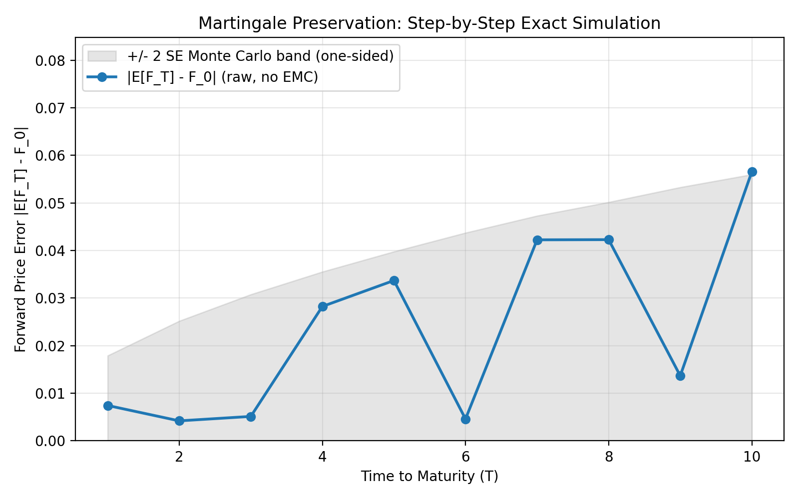
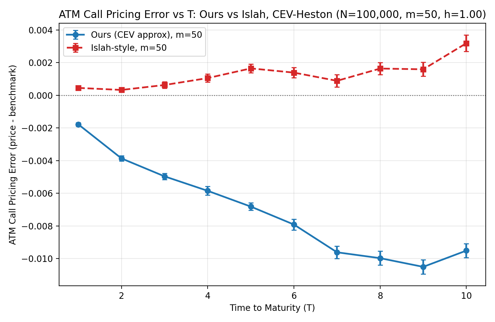
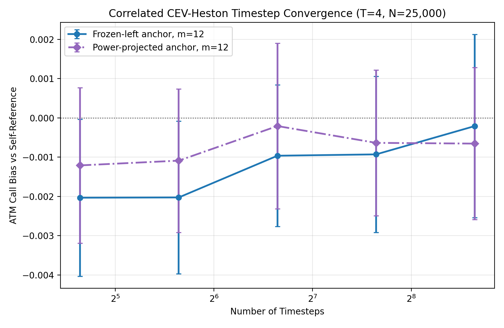
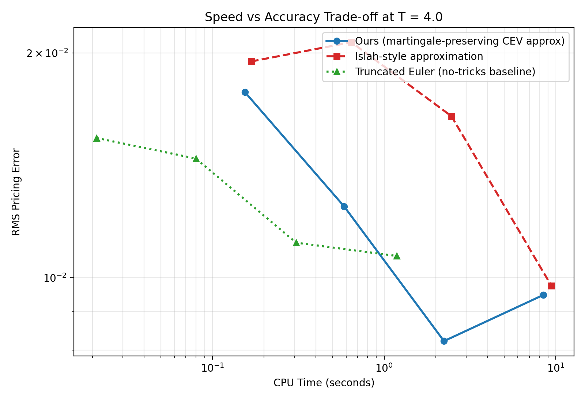

# SABR and CEV-Heston Option Pricing

*Martingale-preserving Monte Carlo pricing of European options under SABR and CEV-Heston, built on Choi-Hu-Kwok (2024) and PyFENG. MATH 5030 final project.*

[](https://colab.research.google.com/github/PXYE-1029/SABR-Option-Pricing-Conditional-MC/blob/main/notebooks/demo.ipynb)

## What this project does

The project develops two Monte Carlo pricers for European options under stochastic volatility:

- **Phase 1 — SABR (`beta = 1`).** Plain Monte Carlo and conditional Monte Carlo, demonstrating textbook variance reduction by conditioning on the volatility path.
- **Phase 2 — CEV-Heston.** A hybrid model in which the asset has CEV elasticity `beta in (0, 1]` and the variance follows the Heston / CIR process. We port the Choi-Hu-Kwok (2024) three-step simulation framework to this setting. The Phase 2 simulator is a martingale-preserving stepwise scheme under the conditional CEV approximation.

CEV-Heston dynamics:

$$
dF_t / F_t^{\beta} = \sqrt{v_t}\,dW^F_t,\qquad dv_t = \kappa(\theta - v_t)\,dt + \xi\sqrt{v_t}\,dW^v_t,\qquad \mathrm{corr}(dW^F, dW^v) = \rho.
$$

## Method

The Phase 2 simulator advances `(F_t, v_t)` over each step in three sub-steps:

1. **Variance step.** `v_{t+h}` and the integrated variance `int v_s ds` over the step are sampled by PyFENG's `HestonMcChoiKwok2023PoisGe` (the Choi-Kwok 2024 Poisson-conditioning scheme). This is the PyFENG-backed variance/integrated-variance backend and is consumed through a thin adapter.
2. **Conditional mean.** Given the sampled `(v_{t+h}, int v ds)`, the forward-price conditional mean is computed in closed form. The key identity is the CIR Ito formula

$$
\int_t^{t+h}\sqrt{v_s}\,dW^v_s \;=\; \frac{ v_{t+h} - v_t - \kappa\theta h + \kappa \int v_s\,ds }{\xi},
$$

   which gives the SABR-side stochastic integral entirely from already-sampled quantities -- no extra random draws are needed for Step 2. This is the single point where the Heston port is structurally cleaner than the original SABR scheme.
3. **Exact CEV sampling.** `F_{t+h}` is drawn from a CEV distribution via the shifted-Poisson-mixture-Gamma representation of Makarov-Glew (2010) and Kang (2014). Three elementary random variates per step (Gamma, Poisson, Gamma); no inverse-CDF root finding.

The simulator keeps the direct frozen-left correlated anchor as a diagnostic baseline and also implements `power_projected`, an improved power-coordinate projected variant that reduces correlated coarse-step bias in the current experiments. The residual bias remains visible in the general correlated case and is treated as a timestep/convergence diagnostic rather than an exact-transition claim.

For comparison we also implement Islah's (2009) approximation, which has been the de facto baseline in nearly every SABR / CEV-Heston simulator since 2009. Islah's scheme uses a modified CEV degree of freedom that breaks the martingale property; we follow Choi et al. (2024, Appendix B) to sample it through the same exact CEV sampler, so the comparison is on equal footing in sampling quality.

The degenerate `xi = 0` case (deterministic mean-reverting variance) is handled by a small bundled Andersen QE stepper, since PyFENG's class divides by `xi^2` in its constructor and cannot be instantiated at `xi = 0`.

Full mathematical derivations and parameter conventions are documented in the `src/` module docstrings.

## Repository structure

```text
src/
  utils.py                        # parameter dataclasses & helpers
  black_scholes.py / sabr_simulation.py / mc_pricer.py / conditional_mc.py / integration.py
                                  # Phase 1 SABR (beta = 1)
  cev_sampling.py                 # Phase 2: exact CEV sampler (paper Algorithm 3)
  pyfeng_adapter.py               # Phase 2: PyFENG variance stepper
  cir_simulation.py               # Phase 2: Andersen QE for the xi = 0 case
  heston_cev_simulation.py        # Phase 2: main CEV-Heston simulator
  islah_approximation.py          # Phase 2: Islah baseline (paper Appendix B)
  heston_cev_benchmark.py         # Phase 2: PyFENG HestonFft / self-reference benchmarks
experiments/                      # runnable experiment scripts
results/{tables,figures}/         # CSV tables and PNG figures produced by experiments
tests/                            # unit tests
```

## Installation

```bash
git clone https://github.com/PXYE-1029/SABR-Option-Pricing-Conditional-MC.git
cd SABR-Option-Pricing-Conditional-MC
python3 -m pip install -e ".[dev]"
python3 -m pytest tests/ -v
```

Runtime dependencies: `numpy`, `scipy`, `matplotlib`, `pyfeng`.

## Quick start

### Phase 1: SABR

```python
from src.utils import SABRModelParameters, EuropeanOption
from src.conditional_mc import price_european_option_conditional_mc

params = SABRModelParameters(
    spot=100.0, initial_volatility=0.2, beta=1.0,
    vol_of_vol=0.4, correlation=-0.3, risk_free_rate=0.01,
)
option = EuropeanOption(strike=100.0, maturity=1.0, option_type="call")
result = price_european_option_conditional_mc(params, option, n_steps=50, n_paths=5000, seed=123)
print(f"{result.price:.4f} +/- {result.standard_error:.4f}")
```

### Phase 2: CEV-Heston

```python
from src.utils import CEVHestonModelParameters, EuropeanOption
from src.heston_cev_simulation import price_european_option_heston_cev

params = CEVHestonModelParameters(
    spot=100.0, initial_variance=0.04, kappa=1.5, theta=0.04,
    xi=0.4, correlation=-0.5, beta=0.5, risk_free_rate=0.0,
)
option = EuropeanOption(strike=100.0, maturity=1.0, option_type="call")
result = price_european_option_heston_cev(params, option, n_steps=20, n_paths=50_000, seed=2026)
print(f"{result.price:.4f} +/- {result.standard_error:.4f}")
print(f"Variance backend: {result.simulation.diagnostics['variance_backend']}")
```

## Running the experiments

```bash
# Phase 1
python3 experiments/experiment_variance.py
python3 experiments/experiment_runtime.py
python3 experiments/experiment_timestep.py
python3 experiments/experiment_validation_bs_limit.py
python3 experiments/experiment_parameter_sweep_nu.py

# Phase 2
python3 experiments/experiment_heston_cev_martingale.py        # martingale preservation
python3 experiments/experiment_heston_cev_option_price.py      # option price vs benchmark
python3 experiments/experiment_heston_cev_zerocorr_option_price.py  # rho = 0 diagnostic
python3 experiments/experiment_heston_cev_timestep_convergence.py   # correlated timestep bias diagnostic
python3 experiments/experiment_heston_cev_speed.py             # speed-vs-RMS trade-off
```

Each script saves a CSV under `results/tables/` and PNGs under `results/figures/`.

## Headline results

### Phase 1 (SABR `beta = 1`)

Conditional MC reduces variance by **42-46x** versus plain MC across all tested path counts, while running slightly faster at large `N`. At `N = 50,000`, plain-MC standard error is `0.059` and conditional-MC standard error is `0.009`.


### Phase 2 (CEV-Heston)

**Martingale preservation.** The regenerated martingale diagnostic keeps the frozen-left scheme's forward error within two Monte Carlo SEMs across `T = 1, ..., 10`; the largest observed deviation is about `1.83` SEMs. Islah shows a systematic positive drift in the same setup.



**Option price diagnostic.** For `beta < 1` the benchmark is a high-resolution self-reference Monte Carlo run, not a closed-form truth price. The original frozen-left correlated anchor has a visible negative coarse-step bias; the new power-projected anchor reduces that bias but does not eliminate it.



**Correlated timestep convergence.** A fixed `T = 4` diagnostic with `n_steps = 25, 50, 100, 200, 400` shows the remaining correlated bias shrinking as the timestep grid is refined. This supports interpreting the residual error as time-discretization bias under the conditional CEV approximation, not as an exact-transition result.



**Speed-vs-RMS trade-off.** The current speed figure is a preliminary diagnostic against the same self-reference benchmark. It compares frozen-left, power-projected, Islah, and truncated Euler on a common grid; it should not be read as a strict dominance ranking.



The test suite covers the core algorithms, special cases (`beta = 1`, `rho = 0`, `xi = 0`), the PyFENG integrated-variance scale, and a fixed-seed correlated-bias regression.

## Structural frozen-coefficient bias in the Heston-CEV port

The option-price experiment shows a residual bias of $\sim 10^{-2}$ at $T = 10$ with $\rho = -0.8$, an order of magnitude larger than what the original SABR paper reports for the same algorithm. This section shows the bias is mathematical, not implementation: SABR's GBM structure makes the leading frozen-coefficient error vanish in expectation, but the analogous cancellation does not occur for CIR.

**Setup (paper Eq. 11, Eq. 13, Eq. 14).** Operator splitting decomposes the asset SDE into

$$
\frac{dF^{(1)}_t}{[F^{(1)}_t]^{\beta}} = \rho\,\sigma_t\,dZ_t \qquad \text{(SABR, Eq. 11a)}
$$

For the Heston-CEV port: $\sigma_t \to \sqrt{v_t}$, $\nu \to \xi$, $dZ_t \to dW^v_t$. The frozen-coefficient approximation (Eq. 13) replaces $[F_s^{(1)}]^{\beta_\ast}$ by $F_0^{\beta_\ast}$ (where $\beta_\ast := 1 - \beta$), yielding the closed-form $F^{(a)}$ in Eq. 14.

**Leading-order frozen error.** Expanding $[F_s^{(1)}]^{-\beta_\ast} = F_0^{-\beta_\ast}\,(1 - \beta_\ast\,\Lambda_s + O(\Lambda_s^2))$ with $\Lambda_s := (F_s^{(1)} - F_0)/F_0$, and using $\Lambda_s = (\rho/F_0^{\beta_\ast})\int_0^s \sigma_u\,dZ_u + O(\rho^2)$ at leading order, the error $\Delta := \log F_T^{(a)} - \log F_T^{(1)}$ becomes

$$
\Delta = \frac{\rho^2 \beta_\ast}{F_0^{2\beta_\ast}}\int_0^T \sigma_s\left(\int_0^s \sigma_u\,dZ_u\right)dZ_s + O(\rho^3) \qquad (\star)
$$

**SABR case: cancellation by GBM identity.** Since $\sigma_s = \sigma_0 \exp(\nu Z_s - \tfrac{1}{2}\nu^2 s)$ is GBM,

$$
\int_0^T \sigma_s\,dZ_s = \frac{\sigma_T - \sigma_0}{\nu} \qquad \text{(exact)}
$$

Applying Itô to $\sigma_s^2$ gives $d(\sigma_s^2) = 2\nu\,\sigma_s^2\,dZ_s + \nu^2\,\sigma_s^2\,ds$, hence $\int_0^T \sigma_s^2\,dZ_s = (\sigma_T^2 - \sigma_0^2 - \nu^2 V_T)/(2\nu)$, where $V_T := \int_0^T \sigma_s^2\,ds$. Substituting both into ($\star$):

$$
\Delta_{\text{SABR}} = \frac{\rho^2 \beta_\ast}{2\nu^2 F_0^{2\beta_\ast}}\left[(\sigma_T - \sigma_0)^2 - \nu^2 V_T\right]
$$

Taking expectation with $\mathbb{E}[\sigma_s^2] = \sigma_0^2\,e^{\nu^2 s}$:

$$
\mathbb{E}\left[(\sigma_T - \sigma_0)^2\right] = \sigma_0^2(e^{\nu^2 T} - 1), \qquad \mathbb{E}[V_T] = \frac{\sigma_0^2(e^{\nu^2 T} - 1)}{\nu^2}
$$

$$
\mathbb{E}\left[(\sigma_T - \sigma_0)^2 - \nu^2 V_T\right] = \sigma_0^2(e^{\nu^2 T} - 1) - \nu^2 \cdot \frac{\sigma_0^2(e^{\nu^2 T} - 1)}{\nu^2} = 0
$$

So $\mathbb{E}[\Delta_{\text{SABR}}] = 0$. **The leading-order frozen error has zero unconditional mean.** The residual SABR bias is $O(\rho^4)$, giving $\sim 10^{-3}$ at Case-V parameters.

**Heston case: cancellation fails.** The CIR Itô identity (course slide M8, p. 9)

$$
\int_0^T \sqrt{v_s}\,dW^v_s = \frac{v_T - v_0 - \kappa\theta T + \kappa V_T}{\xi}, \qquad V_T := \int_0^T v_s\,ds
$$

is the formal analog of the SABR identity but **does not yield the same cancellation**, for two structural reasons:

**(1)** $\sqrt{v_t}$ is not GBM. Itô on $f(v) = \sqrt{v}$ gives

$$
d\sqrt{v_t} = \left[\frac{\kappa(\theta - v_t)}{2\sqrt{v_t}} - \frac{\xi^2}{8\sqrt{v_t}}\right]dt + \frac{\xi}{2}\,dW^v_t
$$

The $-\xi^2/(8\sqrt{v_t})$ drift has no SABR analog and is amplified whenever $v_t$ becomes small (typical under leverage $\rho < 0$).

**(2)** No closed form for $\int v_s^{3/2}\,dW^v_s$. Substituting the CIR identity into ($\star$):

$$
\Delta_{\text{Heston}} = \frac{\rho^2 \beta_\ast}{\xi\,F_0^{2\beta_\ast}} \int_0^T \sqrt{v_s}\,(v_s - v_0 - \kappa\theta s + \kappa V_s)\,dW^v_s
$$

Applying Itô to $v_s^2/2$ yields

$$
\int_0^T v_s^{3/2}\,dW^v_s = \frac{1}{\xi}\left[\frac{v_T^2 - v_0^2}{2} - \kappa\theta V_T + \kappa \int_0^T v_s^2\,ds - \frac{\xi^2}{2}V_T\right]
$$

which depends on $\int_0^T v_s^2\,ds$, a path-dependent quantity that is **not** a function of $(v_T, V_T)$ alone. Using CIR moments

$$
\mathbb{E}[v_T] = \theta + (v_0 - \theta)e^{-\kappa T}, \qquad \mathbb{E}[V_T] = \theta T + (v_0 - \theta)\frac{1 - e^{-\kappa T}}{\kappa}
$$

these moments are rational/exponential in $e^{-\kappa T}$, not pure exponentials in $e^{\nu^2 T}$. The algebraic identity $\mathbb{E}[(\sigma_T - \sigma_0)^2] = \nu^2\,\mathbb{E}[V_T]$ that drove the SABR cancellation has **no analog**: $\mathbb{E}[(v_T - v_0)^2] \neq \xi^2\,\mathbb{E}[V_T]$ in general. Therefore

$$
\mathbb{E}[\Delta_{\text{Heston}}] = O(\rho^2) \neq 0
$$

The leading-order frozen error **survives** unconditional expectation, producing the structural $O(\rho^2)$ option-price bias absent from SABR.

**Numerical confirmation.** At Case-V parameters ($F_0 = 1$, $v_0 = \theta = 0.09$, $\xi = 0.6$, $\rho = -0.8$, $\beta = 0.4$, $T = 10$):

| Setting | Predicted | Observed | SEM |
|---|---|---|---|
| SABR Case V (paper Fig 3b) | $\sim 10^{-3}$ | $\sim 10^{-3}$ | — |
| Heston-CEV, $\rho = -0.8$ | $O(\rho^2) \sim 10^{-2}$ | $-1.06 \times 10^{-2}$ | 51.0 |
| Heston-CEV, $\rho = 0$ (control) | $\sim 0$ | $-9.4 \times 10^{-4}$ | 3.2 |

The ~11× reduction from $\rho = -0.8$ to $\rho = 0$ confirms the $\rho^2$ scaling predicted by ($\star$).

**Implementation validation.** Four independent tests (put into the experiments folder of this repo) rule out implementation bugs:

- **$\beta = 1$ limit** — $[F]^{\beta_\ast} \equiv 1$ makes the frozen approximation trivial. Simulator matches PyFENG `HestonFft` closed form within ~1 SE.
- **$\xi \to 0$ limit** — $v_t$ becomes deterministic, model degenerates to Black-Scholes. Simulator gives 0.2355 vs BS 0.2358 at $T = 4$.
- **CEV degeneration** ($\kappa = 50$, $\xi = 0.01$, $\theta = v_0$, $\beta = 0.4$) — pins $v_t \approx v_0$, model degenerates to pure CEV. Simulator matches PyFENG `Cev` closed form within 2 SE across all tested $(\rho, T)$ pairs, with no $\rho$-dependent systematic offset.
- **Martingale preservation** — $|\mathbb{E}[F_T] - F_0| < 1$ SEM at $T = 10$, while Islah's deviation reaches 19.8 SEM.

Combined with the $\rho^2$ control, the option-price bias is fully attributed to the structural absence of the SABR cancellation under CIR dynamics.

## Limitations

European calls and puts only; American and path-dependent payoffs are out of scope. The Phase 2 advantage over Islah is most pronounced at aggressive parameters (large `xi`, strongly negative `rho`, long `T`), and the benchmark figures above use moderate parameters where both schemes operate comfortably within their stable regimes.

## References

The most central works are:

- Hagan et al. (2002) — original SABR specification
- **Choi, Hu, Kwok (2024)** — the SABR simulation paper this project ports to CEV-Heston
- **Choi, Kwok (2024)** — the Heston Poisson-conditioning scheme used via PyFENG
- Islah (2009) — the classical baseline our scheme corrects
- Makarov-Glew (2010), Kang (2014) — exact CEV sampling
- Andersen (2008) — QE scheme for the `xi = 0` case
- Glasserman (2003), Black-Scholes (1973) — standard background
- MATH 5030 (Numerical Methods) course materials
